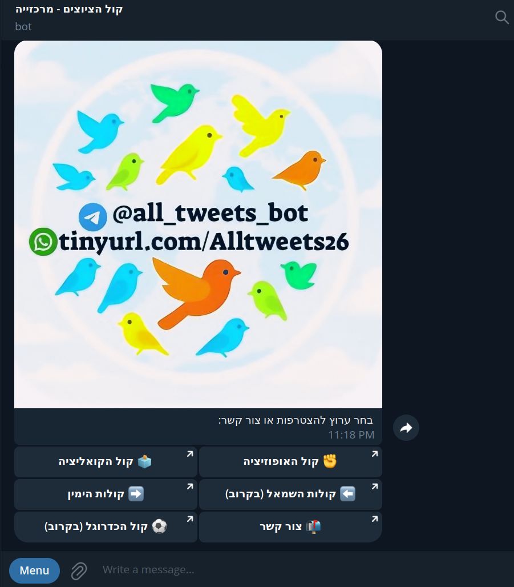
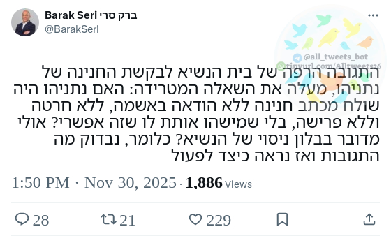
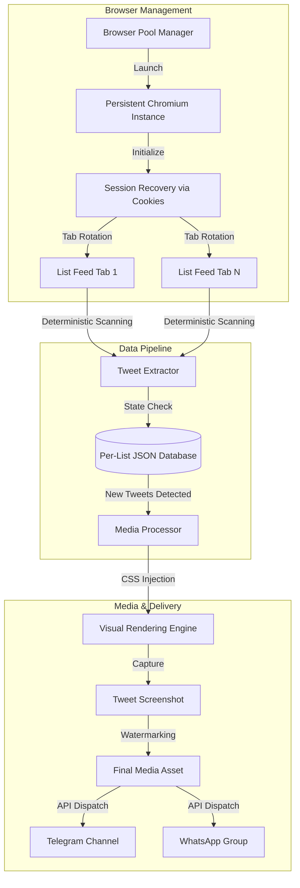

# 🛰️ Twitter / X List Monitor

> **Headless browser–based monitoring of X (Twitter) lists with visual capture & Telegram delivery.**

---

## 📸 Visual Preview

| Desktop View | Tweet Capture | Telegram Delivery |
| :---: | :---: | :---: |
|  |  |  |

---

## 🧠 Project Overview

This project continuously monitors **X (Twitter) Lists** using a **single authenticated browser session**, detects new tweets deterministically, captures **clean visual screenshots** of each tweet, and delivers them to **Telegram channels**.

The system is designed for **long-running, unattended execution**, with strong emphasis on:

- correctness  
- reproducibility  
- memory efficiency  
- operational robustness  

---

## 🧩 Architecture Overview

### High-level flow

1. Puppeteer launches **one persistent browser**
2. Authenticated session is restored via cookies
3. List feeds are scanned incrementally
4. New tweets are persisted to per-list databases
5. Tweets are rendered, cleaned, and visually captured
6. Final images are delivered to Telegram

---

## ⚙️ Key Characteristics

- **Visual Enhancement Suite:** - **CSS Injection:** Dynamically injects fonts and styles into the DOM to ensure maximum readability in captures.
- **UI Sanitization:** Automatically strips distracting elements (Grok, ads, banners) for a clean output.
- **Advanced State Integrity:** - Uses a custom safety-check algorithm (`isOldDbSubsetOfNewDb`) to prevent database corruption.
- **Single-browser architecture:** - Efficiently handles multiple lists by rotating tabs, drastically reducing memory footprint.

---

## 🗂 Configuration Model

All runtime behavior is driven by a **single configuration file**, aggregating:

- global browser settings  
- shared runtime paths  
- per-list definitions (URLs, DB naming, output routing)

This allows:

- scaling from 1 → N lists
- zero code duplication
- predictable operational behavior

---

## 🧪 Operational Notes

- Designed to run **24/7**
- Memory usage is bounded and measured
- Browser crashes trigger clean restarts
- No reliance on undocumented APIs

---

## 🛠️ Engineering Challenges & Solutions

- **The Challenge:** Twitter's dynamic DOM and infinite scroll make deterministic scraping difficult.
- **The Solution:** Implemented a stateful incremental scanner that tracks tweet IDs in a local SQLite/JSON database to ensure zero duplicate captures and zero missed updates.
- **The Challenge:** Puppeteer memory leaks in 24/7 cycles.
- **The Solution:** Developed a "Self-Healing" mechanism that monitors memory thresholds and performs graceful browser restarts without losing the current scan state.

---

## 🛠 Tech Stack

- **Runtime:** Node.js (Asynchronous architecture)
- **Automation:** Puppeteer (Headless Chrome)
- **Persistence:** SQLite / Local JSON (Per-list isolation)
- **Communication:** Telegram Bot API (Multipart/form-data for media)
- **Logic:** Custom-built deterministic feed-diffing algorithm

---

## 🛡️ Resilience & Self-Healing

The system is built for 99.9% uptime in unattended environments:
- **Browser Watchdog:** Automatic detection of browser crashes or "Target Closed" errors with graceful re-initialization.
- **Network Fault Tolerance:** Implemented `Promise.race` with timeouts for page evaluations to prevent hanging on slow network responses.
- **Telegram Rate-Limit (429) Handling:** Built-in intelligence to detect Telegram's `retry_after` parameter and pause execution accordingly.
- **Safe Database Renaming:** Uses a timestamp-based renaming strategy to prevent file corruption during write operations.

---

## ⚠️ Disclaimer

This project is provided **for educational and technical demonstration purposes only**.

- No responsibility is taken for misuse
- Users are responsible for complying with all applicable laws
- The project demonstrates automation and system design techniques

---

## 👤 Author

Built as a **system-level automation project**, focusing on:

- browser internals  
- deterministic data collection  
- long-running reliability  
- operational clarity  

---

## 🚀 Quick Start

1. **Clone & Install:** `npm install`
2. **Environment Setup:** Create a `.env` with `TELEGRAM_TOKEN` and `X_COOKIES`.
3. **Configure:** Edit `config.json` to add your target lists.
4. **Run:** `node src/index.js`